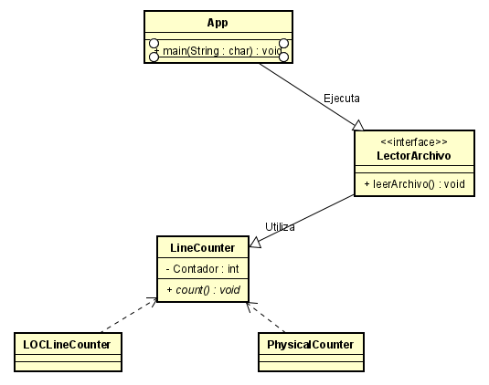
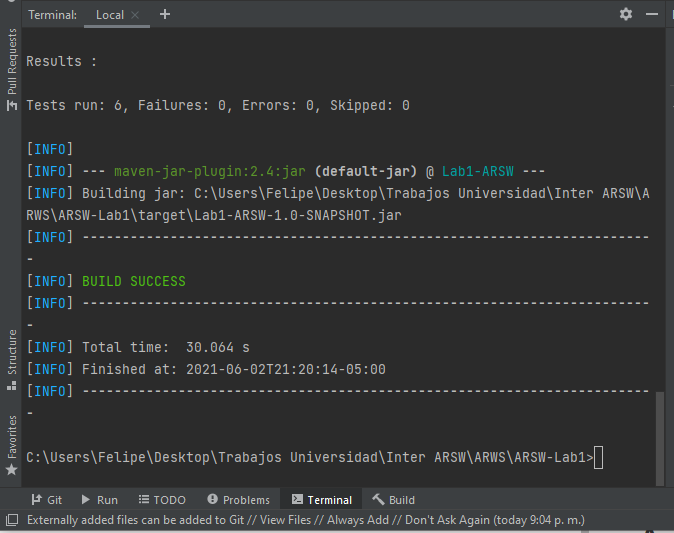
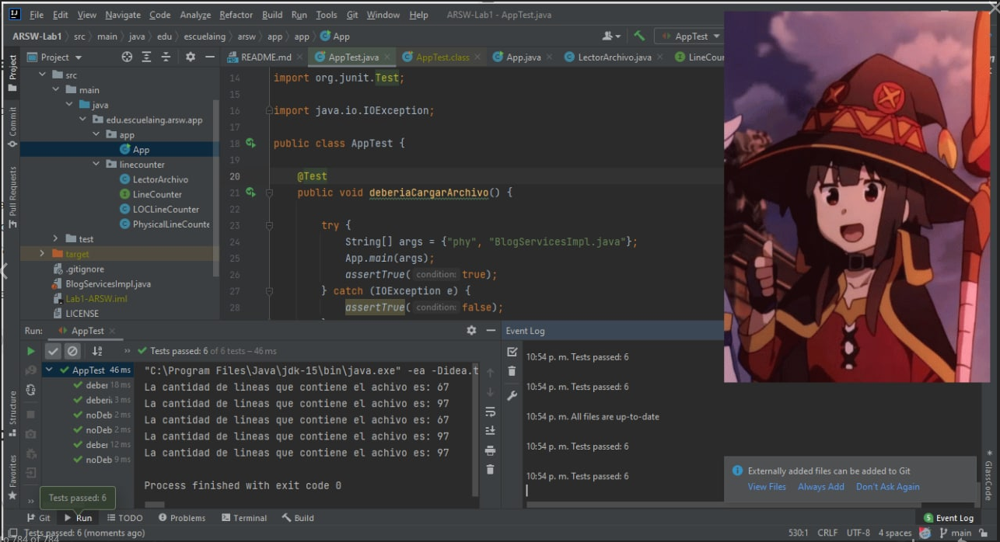
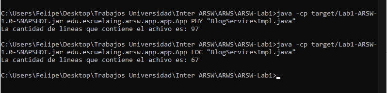

# Lab1 ARSW-LOC Counting

El programa mostrado a continuación se encarga de contar la cantidad de líneas de código de dos manera diferentes, estas son: Físicas (hará un conteo incluyendo espacios) y Excluyente (que eliminará los espacios en blanco y los comentarios)

## Instrucciones de uso

Para poder usar el proyecto lo primero que debe realizar es clonar este repositorio utilizando el siguiente comando desde la terminal del SO que este utilizando:

```
git clone https://github.com/PhillipMarin117/ARSW-Lab1
```
Luego debe redirigirse por medio de la terminal al directorio raíz la cual contiene el achivo pom.xml.

Una vez se encuentre en este directorio se debe compilar el programa para esto se debe ejecutar el siguiente comando:

```
mvn package
```

Para finalizar y ejecutar el programa debe utilizar el siguiente comando:

```
java -cp target/Lab1-ARSW-1.0-SNAPSHOT.jar edu.escuelaing.arsw.app.app.App LOC "BlogServicesImpl.java"
```

Los tipos de comando que se pueden utilizar son los siguientes, recuerde ponerlos en minúsculas 
* PHY: representa las líneas físicas del archivo (TODAS LAS LÍNEAS)
* LOC: representa únicamente las línas de código (excluye comentarios y lineas en blanco)

El archivo __BlogServicesImpl.java__ se encuentra en el mismo directorio que el archivo pom.xml por eso basta con solo colocar el nombre del archivo. Si desea agregar o leer un nuevo archivo basta con colocarlo a la misma altura que este y ejecutarlo con el comando de arriba


### Prerrequisitos

Para ejecutar con éxito este programa se requiere de los siguientes programas instalados en su máquina. Se recomienda tener las versiones actualizadas, pero si no al menos con las versiones básicas funcionales.
Para lograr  conocer si tiene instalados los programas y de paso la versión, ejecute los siguientes comandos
```
java -vesion
git --vesion
mvn -version
```
Le debería aparecer de la siguiente manera 
```
java versionjava version: "1.8.0_171"
git version: 2.19.1.windows.1
Apache Maven version: 3.6.3
```

## Diagrama de clases




## Pruebas del programa

Al ejecutar el comando mvn package  se compila el programa y ejecuta las pruebas al mismo tiempo.


Estas pruebas pruebas la funcionalidad correcta del programa, validando que cargué correctamente los archivos y que el conteo de lineas sea el correcto con un archivo base.

Acá podemos observar como ejecuta de manera correcta los test


A continuación se presenta una imagen detallando el éxito de las mismas:




## Construido con


* [Maven](https://maven.apache.org/) - Dependency Management
* [Java](https://www.java.com/es/download/)
* [Git](https://github.com/) - Versionamiento


## Authors

* **Felipe Marín** - *LOCS/Hora  340/14 = 24 LOCS/Hora* - Fecha: 02/06/2021


## License

This project is licensed under the MIT License - see the [LICENSE.md](LICENSE.md) file for details


### Enlace al sistema de integración continua

_A continuación se presenta el link:_
[](https://circleci.com/gh/PhillipMarin117/ARSW-Lab1)
